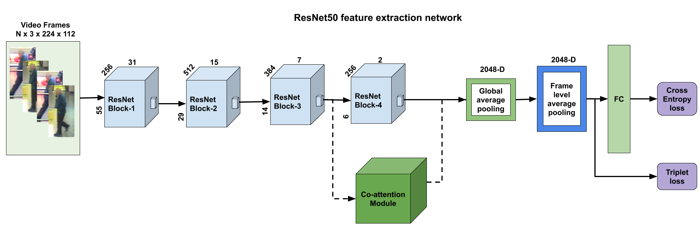
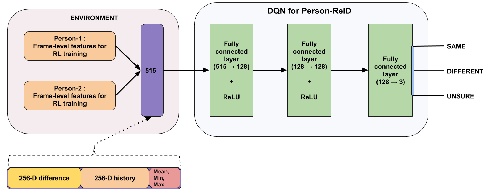

# personreid sequential rl

An independent attempt to replicate the paper "Multi-shot Pedestrian Re-identification via Sequential Decision Making (CVPR2018)"

### Network architecture



## Person ReID as a Decision making problem



### Prerequisites

```
torchvision
torch >= 0.4.0
visdom
tqdm
more-itertools
```

## Data preparation
To prepare data under './data' folder, refer [DATASET](https://github.com/KaiyangZhou/deep-person-reid/blob/master/DATASETS.md) preparation from [deep-person-reid](https://github.com/KaiyangZhou/deep-person-reid) repository. 

### MARS [8]:

1. Create a directory named mars/ under data/.
2. Download dataset to data/mars/ from http://www.liangzheng.com.cn/Project/project_mars.html.
3. Extract bbox_train.zip and bbox_test.zip.
4. Download split information from https://github.com/liangzheng06/MARS-evaluation/tree/master/info and put info/ in data/mars (we want to follow the standard split in [8]). The data structure would look like:

```
mars/
    bbox_test/
    bbox_train/
    info/
```

Use `-d mars` when running the training code.

### iLIDS-VID [11]:

The code supports automatic download and formatting. Simple use `-d ilidsvid` when running the training code. The data structure would look like:

```
ilids-vid/
    i-LIDS-VID/
    train-test people splits/
    splits.json
```

### PRID [12]:

1. Under data/, do mkdir prid2011 to create a directory.
2. Download dataset from https://www.tugraz.at/institute/icg/research/team-bischof/lrs/downloads/PRID11/ and extract it under data/prid2011.
3. Download the split created by iLIDS-VID from here, and put it in data/prid2011/. We follow [11] and use 178 persons whose sequences are more than a threshold so that results on this dataset can be fairly compared with other approaches. The data structure would look like:

```
prid2011/
    splits_prid2011.json
    prid_2011/
        multi_shot/
        single_shot/
        readme.txt
```
Use `-d prid` when running the training code.

### DukeMTMC-VideoReID [16, 23]:

1. Make a directory data/dukemtmc-vidreid.
2. Download dukemtmc_videoReID.zip from https://github.com/Yu-Wu/DukeMTMC-VideoReID. Unzip the file to data/dukemtmc-vidreid. 

You need to have

```
dukemtmc-vidreid/
    dukemtmc_videoReID/
        train_split/
        query_split/
        gallery_split/
        ... (and two license files)
```
Use `-d dukemtmcvidreid` when running the training code.


## Stage-1 : Pre-training

Before posing the person Re-ID task as decision making problem, we need to be able to extract meaningful features from person images. Following transfer learning paradigm, in the pretraining stage, the imagenet pretrained AlexNet is finetuned using the particular video Re-ID dataset identities with the aid of person-classification cross-entropy loss and Triplet loss.

Take a look at the file `src/doall_stage1_pretrain.py` and the command-line options available in API `stage1_parse_cmd_options()` from `src/cmd_options_parser.py` to know more about stage1 training. 

## Stage-2 : DQN training

In stage-2, the Re-ID task is posed as a decision making problem and a Deep-Q Network is trained to maximize the Q-values of actions (SAME, DIFFERENT, UNSURE) with a reward function that encourages seeing less number of frames for the decision.

Take a look at the file `src/doall_stage2_rl_training.py` and the command-line options available in API `stage2_parse_cmd_options()` from `src/cmd_options_parser.py` to know more about stage2 training. 

### Note

This project code is trained and tested only for the dataset PRID2011, as training takes huge amount of time for large datasets (MARS, DukeMTMC-VideoReID) than I could afford at that time. Have a look at the [project report](./docs/project_report.pdf) and [presentation](./docs/presentation.pdf) for more details.

## Credits
A large portion of dataloading, sampling codes are taken from the following repositories:

* [deep-person-reid](https://github.com/KaiyangZhou/deep-person-reid)
* [Video-Person-ReID](https://github.com/jiyanggao/Video-Person-ReID)

